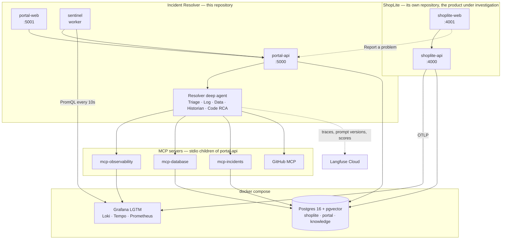

# Incident Resolver

Autonomous support and incident agent. Architecture, agents, and build phases are in [PLAN.md](PLAN.md); vocabulary is in [CONTEXT.md](CONTEXT.md).

## Architecture



Five Node processes and two containers. A Ticket arrives from a customer through the
storefront, from a tester through the portal's own form, or from Sentinel, which watches
ShopLite's error rates and files one by itself. The Resolver investigates it through the MCP
servers, and every write it wants to make stops for a human first.

## Setup

Requires Node 22 (see `.nvmrc`), pnpm 10, and Docker. Two commands, in this repository, once the keys are in place:

```bash
cp .env.example .env   # then fill in the keys below
pnpm setup             # compose up, install, migrate, and seed the knowledge base
pnpm dev               # portal-api on 5000, portal-web on 5001, sentinel watching Prometheus
```

ShopLite is a separate repository ([ADR-0001](docs/adr/0001-shoplite-in-a-separate-repository.md))
and has its own two: `pnpm setup` then `pnpm dev` there, once, before the first demo. See
[ShopLite](#shoplite) below.

### Environment

Copy `.env.example` to `.env`. Every tunable — model names, thresholds, URLs, caps — is read
in `packages/shared/src/config.ts` and has a default that works against the compose stack.
The keys have no defaults:

| Variable | Needed by | Without it |
|----------|-----------|------------|
| `OPENAI_API_KEY` | The Resolver and every subagent, and Sentinel's wording | `RESOLVER=real`, `pnpm resolve` and `pnpm scorecard` cannot run. Sentinel still opens Tickets, worded plainly |
| `COHERE_API_KEY` | `mcp-incidents`: `embed-v4.0` for embeddings, `rerank-v3.5` for rerank | `pnpm seed:incidents` and the incidents server refuse to start, so there is no knowledge base |
| `LANGFUSE_PUBLIC_KEY`, `LANGFUSE_SECRET_KEY` | Tracing, prompt management, and Decision scores | Runs are untraced, Decisions unscored, and every prompt comes from its file. Nothing else changes |
| `GITHUB_TOKEN` | The GitHub MCP server the Fix Shipper pushes the branch and opens the pull request through | A run has no Fix Shipper: Code RCA still patches the code, and a confirmed code bug escalates with the RCA on the timeline and the patch in the Workspace rather than becoming a PR |

`LANGFUSE_BASE_URL` defaults to Langfuse Cloud; point it at a self-hosted instance to keep
the traces local.

### Everything else

```bash
pnpm prompts:sync             # push the agents' prompts to Langfuse prompt management. Optional; needs the Langfuse keys
pnpm portal                   # portal-api alone
pnpm sentinel                 # the Sentinel worker alone
pnpm demo:reset               # put the whole system back where a rehearsal starts
pnpm scorecard                # file every planted bug and check what the agent did with it
pnpm workspaces:clean         # remove every per-Ticket ShopLite clone Code RCA made
pnpm test                     # unit tests, no Docker needed
pnpm test:integration         # tests that need the compose stack, one file at a time
pnpm lint
pnpm typecheck
```

## Layout

```
apps/            portal-api (Tickets, timeline, SSE), portal-web (the Reviewer's portal), sentinel (the watcher)
packages/        shared (config, db client, migrations), mcp-database, mcp-incidents, mcp-observability, agents (Resolver, subagents, prompts, CLI)
scripts/         demo-reset (put everything back), scorecard (replay the planted bugs)
infra/grafana/   dashboards provisioned into the LGTM container's Grafana
```

Tests ending in `.integration.test.ts` need Docker; everything else runs without it. The Workspace integration test needs the network instead: it clones ShopLite, installs it, and walks the double-discount bug from red to green through the tools Code RCA has. The mcp-incidents MCP client test also needs `COHERE_API_KEY` and is skipped without it. The mcp-observability MCP client test also needs ShopLite running, since it generates the declined checkout it then looks for. The agents end-to-end test needs `OPENAI_API_KEY`, `COHERE_API_KEY` and a running ShopLite, and is skipped without the keys; its wiring test needs only Docker.

## ShopLite

The product the agent investigates lives in its own repository, [nirajk77777/shoplite](https://github.com/nirajk77777/shoplite), per [ADR-0001](docs/adr/0001-shoplite-in-a-separate-repository.md). It has no compose file: it reads `DATABASE_URL` and `OTEL_EXPORTER_OTLP_ENDPOINT` from env and uses the Postgres and LGTM containers started here, owning the `shoplite` schema. Clone it next to this repo, then in it run `pnpm setup` and `pnpm dev` for the API on port 4000 and the storefront on port 4001. Its README documents the routes, test cards, a curl checkout, the storefront's cart tag and error toast, and the two demo routes the portal's Demo panel calls.

The storefront is also where demo moment one begins and ends. Every error toast carries a **Report a problem** button that opens a customer Ticket here — the Reporter's email, the trace id of the failed request, and what they were doing in their own words — and the storefront's **My tickets** page reads the Reply back off `GET /reporters/:email/tickets`. Its dev server proxies `/portal/*` to this repo's portal API (`PORTAL_API_URL`, 5000 by default), so the customer never opens the portal.

ShopLite sends traces, logs, and metrics to the LGTM container. The **ShopLite** Grafana dashboard at [localhost:3000/d/shoplite](http://localhost:3000/d/shoplite) shows request rate, error rate by route, p95 latency, the checkout counters, and warn-level logs with clickable trace ids. It is provisioned from `infra/grafana/` through bind mounts in `docker-compose.yml`, so edits to the JSON appear after about ten seconds without restarting.

## Portal API

`apps/portal-api` is the Fastify service that owns the `portal` schema: Tickets from customers, testers and Sentinel, their timelines, and the approval gate's tables. `pnpm portal` starts it on `PORTAL_API_PORT` (5000).

| Route | What it does |
|-------|--------------|
| `POST /tickets` | Opens a Ticket from `source`, `reporterEmail`, `traceId`, `title`, `body`, and starts its run. A customer Ticket without a Reporter email is a 400. A Sentinel Ticket may carry a `fingerprint`; if one is already on an open Ticket the answer is a 200 with that Ticket rather than a 201 with a new one. |
| `GET /tickets` | The queue, newest first. |
| `GET /tickets/:id` | One Ticket with its status, Category, Confidence, Outcome, Reply, and root cause. |
| `GET /tickets/:id/events` | The live timeline as SSE. |
| `GET /tickets/:id/approvals` | Every Proposal this Ticket has raised, newest first, with what the Reviewer decided and what running it did. |
| `POST /tickets/:id/decision` | The Reviewer's Decision on the Proposal the Ticket is waiting on: `{"decision":"approve"}`, `{"decision":"edit","proposal":{…}}`, or `{"decision":"reject","reason":"…"}`. 202 once recorded; the run carries on in the background. A Decision the action does not allow is a 400, and a second one on the same Proposal is a 409. |
| `POST /tickets/:id/resolution` | How a Reviewer finishes an escalated Ticket: `{"rootCause":"…","resolution":"…","reply":"…","author":"…"}`. Closes it on their wording and writes their Incident. Anything but an escalated Ticket nobody has resolved is a 409. |
| `POST /tickets/:id/rerun` | Runs a closed Ticket again, on the next run number and its own thread. 202 with the reopened Ticket; a Ticket still running is a 409. |
| `GET /reporters/:email/tickets` | What the storefront's "My tickets" page reads: one Reporter's Tickets and Replies. This is how a customer Reply is delivered; the email step is a stub that logs it. |
| `GET /config` | What portal-web needs from the portal's configuration: the Resolver in use, and the Grafana and Langfuse base URLs its trace links are built from. |
| `POST /demo/simulate-traffic` | Relays a burst of empty-cart checkouts to ShopLite, status and all. The Demo panel's first button. |
| `POST /demo/reset` | Puts everything back where a rehearsal starts, and reports each step. A 409 while any Ticket is still running. |
| `GET /health` | Liveness, and which Resolver is selected. |

A Ticket moves `new` → `triaging` → `investigating` → `awaiting_approval` → `acting` → `closed`, and `closed` always carries exactly one Outcome and one Reply, which a check constraint on the table enforces. The lifecycle is derived in the portal from the Resolver's stream, never inside the agent. A run that fails after LangChain's retries, or times out (`RUN_TIMEOUT_MS`), closes the Ticket as `escalated` with the holding Reply and everything it had already reported, rather than leaving it stuck.

### Escalation, and the Incident a close leaves behind

Three things put a Ticket in front of a person. The Resolver can call `escalate_to_human`, which writes nothing and stops for nobody: once it has, the Ticket is escalated whatever Verdict the run then returns. A Verdict below `CONFIDENCE_THRESHOLD` is escalated too, whatever Outcome it claims — the rule is applied both where the run reports its Verdict and where the portal closes the Ticket on one, so it holds for every Resolver behind the seam. And a run that never reaches a Verdict at all is escalated with reason `agent_error`. In all three the root cause and the Evidence survive onto the timeline and the Ticket; only the Reply is swapped for the holding message, because an answer nobody trusts must not reach the Reporter.

`POST /tickets/:id/resolution` is how a person finishes one. The Ticket stays `closed` and its Outcome stays `escalated` — that is how it ended — but the Reviewer's Reply replaces the holding message, their root cause and resolution go on the row, and it is marked resolved by a human, which is what takes it off the waiting list.

Either way of finishing writes an **Incident** to the `knowledge` schema, embedded with the same Cohere model `mcp-incidents` indexes with, so the next similar Ticket's Historian finds it. It is derived rather than asked of a model: an agent-resolved Ticket's Incident comes from its Verdict (symptoms from the Ticket body and the Evidence, root cause and resolution from the Verdict, `resolvedBy` `agent`), and a human-resolved one from what the Reviewer wrote (`resolvedBy` `human`, with their name as the author). Escalated Tickets nobody has picked up write none: there is nothing to teach yet. One Ticket has one Incident, so re-running it or resolving it by hand replaces what it wrote before. Without `COHERE_API_KEY` nothing is written and Tickets still close, exactly as they do untraced without the Langfuse keys.

`POST /tickets/:id/rerun` reopens a closed Ticket and starts the next run. The run number is the highest the timeline holds plus one, and the LangGraph thread is derived from the Ticket and that number, so a fresh run can never resume the last one's checkpoint. What the earlier runs did stays on the timeline under their own run numbers; the row's Outcome, Reply, Category, Confidence and root cause are cleared, since a Ticket cannot be closed and running at once. Only a closed Ticket can be re-run: one run at a time is the only writer of the row. A Ticket a person resolved cannot be re-run at all — clearing the row would take their Reply off the Ticket the Reporter is reading, so looking again means a new Ticket.

Each entry of the timeline is a `portal.ticket_events` row, written as the run streams and published to every open SSE connection. Frames are unnamed, so `new EventSource(url).onmessage` receives the whole timeline and reads the kind of entry off `type` in the data: `subagent_start`, `subagent_end`, `tool_call`, `tool_result`, `message`, `interrupt`, `decision`, `verdict`, or the portal's own `status`. A `tool_result` says whether the tool answered: a call that did not — an unscoped query on a customer Ticket turned away by the tenant guard, a statement that is not a single `SELECT`, a log search that timed out — arrives with `failed` set and the reason as its result, so it is on the record rather than looking like a call that came back empty. It says `failed` rather than `rejected` because the stream reports the error as text, so a guard's refusal and a broken connection cannot be told apart there; the reason on the card says which. The frame id is the entry's sequence, so a reloaded page sends `Last-Event-ID` (or `?lastEventId=`) and gets exactly what it missed before the stream goes live. Entries carry the run number, counting re-runs of a Ticket from 1. Tickets run concurrently, one independent run each.

### The approval gate

Every write the agent can make stops for a human first (PLAN.md section 5). The Resolver's own tools are the writes — `apply_data_fix`, `create_pull_request`, and `send_customer_reply` — and Deep Agents' `interruptOn` raises a LangGraph interrupt before any of them runs. [ADR-0003](docs/adr/0003-the-resolver-owns-every-write.md) records why the gate is on the Resolver's tools rather than on the Data Investigator's `propose_data_fix`.

When a run stops, the portal writes a `portal.approvals` row with the Proposal and, for a data fix, the rows it would touch as they are now, puts an `interrupt` entry on the timeline, and moves the Ticket to `awaiting_approval`. `POST /tickets/:id/decision` records the Decision, writes a `decision` entry, and resumes the same LangGraph thread: an edit reaches the agent as the arguments of the call it was interrupted on, so the tool runs on the Reviewer's wording, and a rejection reaches it as a reason it reads before deciding what to do instead. A Reply a Reviewer approved is what the Ticket closes with, even if the Resolver then worded its Verdict differently.

An approved pull request is the only write in the system that reaches GitHub. The Fix Shipper has already pushed the branch by the time the Reviewer sees the card — a branch nobody has been asked to merge changes nothing anyone reads — so what the approval holds is the pull request itself, against ShopLite's default branch. On approval the portal opens it through the GitHub MCP server, writes the result onto the approval, and puts the link on the Ticket as an internal note; the customer's Reply says the bug is confirmed and a fix is underway and never carries the link. A Ticket cannot close `fix_proposed` unless an approved pull request actually opened, the same check `data_fixed` gets.

An approved data fix is the only write in the system that touches ShopLite data. It runs as `shoplite_writer`, a role created by migration 0007 with `UPDATE` and `DELETE` on the `shoplite` schema and nothing else — no `INSERT`, no DDL, no other schema — from `SHOPLITE_WRITE_DATABASE_URL`. The statement is parsed and must be one `UPDATE` or `DELETE` with a `WHERE` clause on a ShopLite table; inside one transaction the rows it matches are snapshotted onto the approval and counted against `DATA_FIX_ROW_CAP`, and anything over the cap or any failure rolls the whole thing back. A Ticket cannot close `data_fixed` unless an approved fix actually changed rows.

Each Decision goes back onto the run's Langfuse trace as a score (`approved`, `edited`, `rejected`), and each Outcome as `resolved` or `escalated` at close, which turns the gate into an evaluation dataset. Without the Langfuse keys nothing is scored, exactly as nothing is traced.

`RESOLVER` chooses what investigates a Ticket, through one `TicketResolver` seam that nothing downstream can see past.

- `fake` is a scripted stand-in that emits Triage and Investigator events, a tool call and its result, a message, and a fixed Verdict, with `FAKE_RESOLVER_STEP_DELAY_MS` between them: the whole lifecycle is exercisable over HTTP with no model and no API key. On a customer Ticket it first tries an unscoped query and is refused, so the tenant guard is visible on a demo running no model at all.
- `real` is the Resolver from `packages/agents`. It needs `OPENAI_API_KEY` and `COHERE_API_KEY`, and everything the CLI needs: the compose stack, ShopLite migrated, seeded and running, and `pnpm seed:incidents` done. Each Ticket gets its own MCP servers, scoped to the Reporter, and its own LangGraph thread; the models, the prompts and the checkpointer are the portal's and are shared across runs. Every LangChain event the run produces becomes a timeline entry: a `task` call opens a subagent card and its return closes it, and every other tool call and result is a card of its own, nested subagent tools included.

A traced run reports the Langfuse trace it is writing to before it does any work. That is not a timeline entry — it goes on the Ticket as `langfuseTraceId`, so the portal can link to the trace of whichever run is the latest.

## Portal web

`apps/portal-web` is the Reviewer's portal: a Vite React app on 5001 that reads portal-api through a dev-server proxy on `/api`, so requests are same-origin and the API needs no CORS.

```bash
pnpm portal                                        # portal-api on 5000
pnpm --filter @incident-resolver/portal-web dev     # portal-web on 5001
```

`pnpm dev` starts both, along with every other package that has a dev script.

- **Queue** (`/tickets`): every Ticket newest first, with its status, Source, Category, Outcome and Confidence. It re-reads itself every few seconds, so a Ticket filed elsewhere appears without a reload.
- **Approval card**: when a run stops for a Decision, the card is the loudest thing on the Ticket. A data fix shows its reason, the statement in an editable textarea, and a table of the rows it would change as they are now; a Reply shows its wording in an editable textarea; a pull request shows its branch, files and body, and is approve or reject only. Approving after an edit sends the Reviewer's version. What was already decided, and what running it did, stays on the Ticket beside the Resolution.
- **Ticket** (`/tickets/:id`): the live Timeline, as a transcript. One rail down the left with the elapsed offset in the gutter and a marker per entry: subagent start and end, tool call and result, message, interrupt, Decision, Verdict, and the portal's own status moves as rules across the rail. A tool call that did not answer — the tenant guard turning one away, or a tool that broke — is outlined and marked `no answer`, with the reason on the card, so the Reviewer never reads a refusal as an answer. Payloads are collapsed by default and Evidence is set in monospace; the Verdict card carries the Reply. The panel beside it fills in with the Outcome, Confidence, root cause, Reply and Evidence as the run reaches them.
- **Resolve manually**: an escalated Ticket nobody has picked up carries a form in the approval card's place — root cause, what fixed it, the Reply the Reporter reads instead of the holding message, and the Reviewer's name. Submitting it closes the Ticket on that wording and writes the Incident; what they wrote then sits beside the Resolution.
- **Re-run**: every closed Ticket carries a Re-run button beside its status. It starts the next run on a fresh thread and the new entries arrive on the open stream under their own run number, with the earlier runs left where they are, each under its own heading.
- **File a ticket** (`/tickets/new`): a summary, what went wrong, optional steps to reproduce, and an optional ShopLite trace id. Filing it starts the run and opens its Timeline.
- Each Ticket links out to the two traces it carries: the Resolver run in Langfuse, and the ShopLite request in Grafana Explore against Tempo. Both appear only once there is a trace id to point at, and both base URLs come from `GET /config`.

## MCP servers

Custom MCP servers run over stdio as child processes of portal-api. Each one can also be started by hand for a quick check with an MCP inspector.

### mcp-database

`packages/mcp-database` gives the agent `describe_schema`, `run_readonly_sql`, and `propose_data_fix` over ShopLite's data.

- It connects as `shoplite_reader`, a role created by migration 0002 with `SELECT` on the `shoplite` schema and nothing else, so Postgres refuses every write whatever the tool layer does. The URL is `SHOPLITE_READONLY_DATABASE_URL`.
- Start it with `REPORTER_CUSTOMER_ID` or `REPORTER_EMAIL` for a customer Ticket. It then rejects any SELECT on a customer-owned table that does not filter by that customer, and exits if the reporter is not a ShopLite customer. Leave both unset for tester and Sentinel Tickets.
- Every result is redacted before it leaves the server: card numbers are masked entirely, and every email except the reporter's is masked.
- `run_readonly_sql` returns at most `QUERY_ROW_CAP` rows and says when it truncated.
- `propose_data_fix` never executes. It checks the statement is a single `UPDATE` or `DELETE` with a `WHERE` clause on a ShopLite table, counts the rows it would touch, and returns a Proposal for the approval gate. The portal holds the same statement to the same check before it runs one, so a Reviewer's edit is guarded exactly as the agent's own wording was.

```bash
REPORTER_EMAIL=ava.chen@example.com pnpm --filter @incident-resolver/mcp-database start
```

Its integration tests drive the tools through the MCP client and need ShopLite migrated and seeded.

### mcp-incidents

`packages/mcp-incidents` gives the agent the knowledge base: `search_similar_incidents`, `get_incident`, `save_incident`, and `search_help_articles`.

- Incidents and Help articles live in the `knowledge` schema (migration 0003) with a `vector(1536)` embedding each. Embeddings come from Cohere `embed-v4.0` through `@langchain/cohere`, which sends `search_document` when indexing and `search_query` when searching; the wrapper cannot set the output dimension, so 1536 is the model default.
- Both searches share one pipeline: pgvector returns the `KNOWLEDGE_SEARCH_CANDIDATES` (20) nearest rows by cosine similarity, then Cohere `rerank-v3.5` narrows them to `k` (default `KNOWLEDGE_SEARCH_TOP_K`, 3) with a relevance score from 0 to 1. The score is what Triage's Confidence is built from.
- `save_incident` writes the distilled record: title, symptoms, root cause, resolution, Category, source Ticket id, who resolved it, and the author. The portal does not call it through MCP — it writes the Incident itself at close, derived from the Verdict or from what a Reviewer wrote, with no second model call — but the tool is what makes the same write reachable from a CLI run or an inspector. Help articles are seeded and never written by the agent.
- `pnpm seed:incidents` resets both tables and writes twenty ShopLite Incidents dated March to September 2026 by three authors, three of them about the stale cart total problem so rerank has to choose, one a red herring that shares the words but is a discount rule, plus ten Help articles. The seed data is in `packages/mcp-incidents/src/seed-data.ts`.
- It needs `COHERE_API_KEY` and refuses to start without it.

```bash
COHERE_API_KEY=... pnpm --filter @incident-resolver/mcp-incidents start
```

Its integration tests drive the tools through the MCP client and reseed the knowledge schema first, so they need Docker and the Cohere key. The pgvector store test needs only Docker, and the test that proves the documented cart_totals UPDATE against ShopLite's pricing rules needs ShopLite migrated and seeded.

### mcp-observability

`packages/mcp-observability` gives the agent ShopLite's telemetry in the LGTM container: `search_logs` over Loki, `get_trace` over Tempo, `query_metrics` and `get_error_rate` over Prometheus, and `list_recent_errors` across all three.

- `search_logs` takes free text, a window such as `15m`, a level meaning that level and above, and an optional trace id, and builds the LogQL itself: `{service_name="shoplite-api"} |~ "(?i)text" | detected_level=~"warn|error|fatal" | trace_id="..."`. It looks back one hour by default, or a day when a trace id is given, since the request behind a Ticket may be hours old. Lines come back newest first with their level, trace and span ids, and the structured fields pino attached, minus the OTel resource noise. At most `LOG_LINE_CAP` lines come back and the result says when it truncated.
- `get_trace` fetches the OTLP trace from Tempo and reduces it to the root span, route, method, status code, every span in start order with hex ids and plain attributes, and the spans that ended in error with their exception events.
- `query_metrics` runs any PromQL: evaluated now without a window, or as a range over the window with about thirty points per series.
- `get_error_rate` counts one route's responses by status code over the window from the OTel HTTP histogram, as the counter's growth since the start of the window rather than `increase()`, so the count is exact and a 60s window works with ShopLite's 10s export interval. `errorRate` counts every 4xx and 5xx, so a declined card (402) counts; `serverErrorRate` counts 5xx only. Which ratio Sentinel thresholds is Sentinel's decision.
- `list_recent_errors` is the starting point for a Ticket without a trace id: routes that returned errors with their rates, `checkout_errors_total` by reason, and the warn-and-above lines grouped by message with trace ids to follow. If one store is unreachable the other signals still come back and `warnings` says what is missing.
- Every result is redacted before it leaves the server: card numbers are masked entirely, and every email except the reporter's is masked. Start it with `REPORTER_EMAIL` for a customer Ticket; leave it unset for tester and Sentinel Tickets.
- `SHOPLITE_SERVICE_NAME` (default `shoplite-api`) is the `service_name` label in Loki and the `job` label in Prometheus.

```bash
REPORTER_EMAIL=ava.chen@example.com pnpm --filter @incident-resolver/mcp-observability start
```

Its integration tests generate one declined checkout against a running ShopLite, then drive every tool through the MCP client, polling the Prometheus-backed tools until ShopLite's next metric export lands.

## Resolver

`packages/agents` is the agent itself: the Resolver deep agent, its Triage subagent, three Investigators, Code RCA and the Fix Shipper, the prompts, and a CLI that runs one Ticket and prints the Verdict.

- The Resolver is a Deep Agents JS agent on `gpt-5.4` with a Postgres checkpointer in the `portal` schema, one LangGraph thread per run. Triage, the three Investigators and the Fix Shipper are subagents on `gpt-5.4-mini` and Code RCA is one on `gpt-5.4`, all reached through the `task` tool. Every model name comes from `packages/shared/src/config.ts`.
- Triage's only tool is `search_help_articles`. It returns Zod-structured output: Category (`question`, `user_error`, `data_issue`, `code_bug`, `infra`, `unknown`), severity, component, hypothesis, Confidence, the matching Help article ids, and the best article's text.
- Fast path: a `question` with a Help article at or above `CONFIDENCE_THRESHOLD` is answered from the article with Outcome `answered` and no Investigator run.
- Anything else fans out to all three Investigators in one turn, so their spans overlap in the trace instead of queueing: the **Log Investigator** over the mcp-observability tools (the trace and log lines behind the request, and whether the route is failing for everyone), the **Data Investigator** over the mcp-database tools (the Reporter's rows, and a data fix Proposal when one is wrong), and the **Incident Historian** over the mcp-incidents read tools (past Incidents with their documented resolution, after Cohere rerank). Each returns a short Evidence summary whose every entry carries its provenance.
- The procedure is enforced in code, not only in the prompt. A middleware on the `task` tool refuses any subagent that is not declared, refuses an Investigator before Triage has run or when the fast path applies, refuses Code RCA until all three Investigators have reported, refuses the Fix Shipper until Code RCA has, refuses a second run of one that has already reported, and appends Triage's hypothesis to each Investigator's brief as focus — worded so it narrows where an Investigator looks first and never licenses it to skip its own source. A refused delegation comes back as a tool error saying what to do instead, so the run continues. The run report flags a run that investigated with fewer than three, or launched them in separate turns.
- When the Evidence points at a defect in ShopLite's source, the Resolver delegates to **Code RCA** on `gpt-5.4`. It works in a **Workspace**: this Ticket's own clone of the ShopLite repository, made the first time a run delegates to it and never before, so a Ticket answered from a Help article pays for no clone. It reads the code, writes a test that fails the way the Reporter described, patches the defect, and runs the suite until it is green, then returns the root cause with the file and the line, the test it wrote, the files it changed, and whether the tests pass.
- With the tests green, the Resolver delegates to the **Fix Shipper** on `gpt-5.4-mini`. It lists what Code RCA changed, reads those files — the Workspace is read-only to it, so what reaches the branch is what Code RCA left there — and pushes them with `push_files` to `fix/ticket-<ticket id>` through the GitHub MCP server, then writes the pull request title and the RCA body. It never runs a git command and there is no credential on the machine to run one with: the token lives in the MCP server's headers, and a middleware overwrites the owner, repository, branch and base on every GitHub call, so a model that names another repository still pushes to this one. Opening the pull request is the Resolver's own gated call — and the branch is not one of its arguments, being derived from the Ticket id on both sides of the gate, so the branch a Reviewer approves and the branch GitHub is asked for are the one the patch is on. The Ticket closes `fix_proposed` once the pull request exists, and a customer Reply that carried the link has it taken out before the Ticket closes: the link lives on the Timeline as an internal note.
- Code RCA has **no shell** ([ADR-0002](docs/adr/0002-no-shell-for-the-code-agent.md)). It gets the file tools plus exactly two fixed commands wrapping `execa`: `run_tests` runs ShopLite's suite, `git_diff_names` lists what it changed. Neither takes an argument, so the honest answer to what an agent with code access can run here is those two lines. The Workspace is mounted at `/workspace` on the agent's filesystem, backed by a `FilesystemBackend` in virtual mode so a path that climbs out is rejected before it reaches the disk, and the route is denied to the Resolver and every other subagent by filesystem permissions — Code RCA is the only agent let in. Routing rather than rooting the whole agent at the clone keeps the agent's own evicted tool results out of ShopLite's working tree, where `git_diff_names` would report them as part of the patch.
- Workspaces live in `WORKSPACES_DIR` (`workspaces/` at the repo root, gitignored), one directory per Ticket id, cloned from `SHOPLITE_REPO_URL`. A re-run of the same Ticket clones afresh, so it never reads the last run's patch. `pnpm workspaces:clean` removes them all, leaving anything under the root that is not a Workspace; the demo reset, when it arrives, calls the same store.
- The run ends with a Verdict in a Zod response format: Outcome, Category, Confidence, root cause, Evidence references, and the Reply. A Verdict below the threshold is escalated in code, whatever the model wrote, and so is any run that called `escalate_to_human`.
- The Resolver's own tools are the writes — `apply_data_fix`, `create_pull_request` and `send_customer_reply` — and every one of them is behind the approval gate. What each does is injected: the portal runs an approved fix through the writing role and opens an approved pull request through the GitHub MCP server, and a run from the command line has no Reviewer, so it rejects both with a reason the Resolver acts on and writes nothing.
- Prompts are markdown in `packages/agents/prompts/`, one per agent, with `{{confidenceThreshold}}` filled from config. `pnpm prompts:sync` pushes them to Langfuse prompt management under `LANGFUSE_PROMPT_LABEL` (default `production`), skipping any whose text already matches the labelled version. At startup the agent fetches each prompt by name and label and falls back to the repository file whenever Langfuse is unconfigured, has no version under that label, or is unreachable, so a run never waits on the network. Which version each prompt came from is on the trace as `prompt.<name>` and in the CLI's run report.
- Tracing is Langfuse v5: a `LangfuseSpanProcessor` in the OTel Node SDK plus the LangChain `CallbackHandler` on every invoke. The session id is the Ticket id, tags carry the Source, the model names, and the Category, and the subagent and tool spans nest under the run. Set `LANGFUSE_PUBLIC_KEY` and `LANGFUSE_SECRET_KEY`; without them the run is untraced and every prompt comes from its file. `LANGFUSE_BASE_URL` defaults to Langfuse Cloud.
- The three built MCP servers are spawned per run as stdio children from their own package directories, the way portal-api spawns them. For a customer Ticket the database and observability servers are started with the Reporter's email, so every query is scoped to that customer and every other email is masked. GitHub is the one server bought rather than built: the official remote server over HTTP, added to a run only when `GITHUB_TOKEN` is set, with `X-MCP-Toolsets: repos,pull_requests` so the toolsets outside those two are not there to call. A portal without the token still investigates every Ticket and Code RCA still patches the code; there is simply no Fix Shipper, and such a run escalates with the patch in the Workspace.

The CLI takes a Ticket as JSON (`id`, `source`, `reporterEmail` for customers, optional `traceId`, `title`, `body`) and prints the Verdict, Triage, the subagents that ran, whether the fast path was taken, whether the three Investigators ran in parallel, and the prompt versions. Four demo Tickets ship with the package. It needs the compose stack, ShopLite migrated, seeded and running, `pnpm seed:incidents` done, and `OPENAI_API_KEY` and `COHERE_API_KEY` in `.env` or the shell.

```bash
pnpm prompts:sync                                              # optional: push the prompts to Langfuse
pnpm resolve packages/agents/tickets/images-not-loading.json   # answered from the clear cache article, Triage only
pnpm resolve packages/agents/tickets/declined-card.json        # answered from the payments row and the decline log line
pnpm resolve packages/agents/tickets/stale-cart-total.json     # matched to a seeded Incident, whose documented UPDATE it takes to the gate
pnpm resolve packages/agents/tickets/double-discount.json      # a code bug: Code RCA clones ShopLite, writes a failing test, patches it, and runs the suite green
```

Paths are relative to where you run the command. Pass `-` to read the Ticket from stdin, and `--thread <id>` to name the LangGraph thread; by default each run gets a fresh thread named after the Ticket id and the time.

The double-discount Ticket needs nothing in ShopLite's data: the bug is in `apps/api/src/domain/order.ts`, which prices an order from a subtotal that has already had the discount taken off, and Code RCA finds it in the clone. The two other investigated Tickets assume the state they describe exists in ShopLite: the declined-card Ticket needs a recent checkout with a card ending in 0002, and the stale cart total Ticket needs a cart whose line was removed through `DELETE /customers/:customerId/cart/items/:productId`, which leaves `cart_totals` holding the old count. The end-to-end test creates both against a running ShopLite before it runs.

## Sentinel

`apps/sentinel` is the watcher: nobody has to notice ShopLite is broken for a Ticket to
exist. `pnpm sentinel` starts it, and `pnpm dev` starts it alongside everything else.

- It is a **plain LangGraph**, not a deep agent (PLAN.md section 4). Four nodes — watch,
  gather, compose, open — and one pass over the graph is one poll. The worker runs a pass
  every `SENTINEL_POLL_INTERVAL_MS` (10s) and starts the wait when the last pass finished, so
  a slow Loki delays the next poll rather than stacking passes on top of it.
- **The rule is arithmetic.** A route fires when its **server**-error ratio exceeds
  `SENTINEL_ERROR_RATIO` (20%) over `SENTINEL_WINDOW_SECONDS` (60s) with at least
  `SENTINEL_MIN_REQUESTS` (5) requests behind it. 5xx only: a declined card is a 402 and is
  the customer's problem, not an outage. The counts come from the same Prometheus query
  `get_error_rate` uses, which is the counter now minus the counter at the start of the
  window, so a 60s window works with ShopLite's 10s export interval.
- **Evidence, then wording.** Once a route fires, Sentinel reads the warn-and-above lines of
  that window out of Loki and attaches their trace ids, so the Log Investigator starts on a
  real request instead of on a search. `gpt-5.4-nano` is then given the finding and asked for
  a title and a body, and for nothing else: the route, the ratio, the counts and the trace
  ids are attached from what was measured, so a Ticket can never carry a number the model
  invented. Without `OPENAI_API_KEY`, or when the model will not answer, the Ticket is worded
  plainly from the same brief and is opened all the same.
- **One Ticket per problem.** Every detection carries a **fingerprint** of the route and the
  status code most of its failures came back as, such as
  `/customers/:customerId/checkout:http_500`. `POST /tickets` answers a fingerprint that is
  already on an open Ticket with a 200 and that Ticket, and a partial unique index on
  `portal.tickets` makes that true even if two detections land at once. Closed Tickets are
  outside the index, so the same route failing next week opens a new one. Sentinel also holds
  each fingerprint for the length of its own window after reporting it: a detection is made
  over sixty seconds and those requests stay inside that window, so without the hold the next
  poll would file a second Ticket about the same failures.
- It reaches the portal over plain HTTP on `PORTAL_API_URL`, the same surface the storefront
  and the tester form use. Sentinel is not privileged and holds no database connection.

## Rehearsing

Three props, so a demo can be given twice in a row and the agent can be checked without
walking it by hand.

### The Demo panel

**Ctrl + Alt + D** in the portal reveals it; Escape or the same chord closes it. Hidden
because a Reviewer has no business resetting the system or making ShopLite fail on purpose,
and in the portal because the alternative during a demo is a second terminal on screen.

- **Simulate traffic** sends thirty seconds of empty-cart checkouts at ShopLite, one every
  250ms, which the checkout route does not survive. Its error ratio climbs where Prometheus
  can see it and Sentinel opens a Ticket about it by itself, which is demo moment four. The
  portal relays the burst to ShopLite (`SHOPLITE_API_URL`) and passes its answer back
  unchanged, so a burst already running comes back worded as ShopLite worded it.
- **Reset** is `pnpm demo:reset` under the same button.

### `pnpm demo:reset`

Puts everything back where a rehearsal starts, and says what it did:

```
ok    ShopLite data: reseeded through http://localhost:4000
ok    Tickets, their timelines and approvals: 3 Tickets removed
ok    Run checkpoints: cleared checkpoint_writes, checkpoint_blobs, checkpoints
ok    Workspaces: every per-Ticket ShopLite clone removed
ok    Incidents: 20 kept: the knowledge base is not part of a reset
```

Incidents are kept on purpose: they are the knowledge base, twenty seeded plus whatever the
agent has learned, and a rehearsal without them would be rehearsing a different system.
Timelines and approvals go with their Ticket rather than being cleared separately — both
tables cascade from `portal.tickets` — and Workspaces go because a clone left behind would
let a re-run read the last run's patch. A step that fails is reported and the rest still run,
so ShopLite being down does not leave the portal full of last rehearsal's Tickets. The portal
refuses a reset while a Ticket is still running: deleting one out from under its own run
leaves the run writing to something that is not there.

### `pnpm scorecard`

Files every planted bug as a Ticket, approves whatever each run stops on, and reports the
Category and the Outcome against what that bug should produce:

```
      bug               category                 outcome                       confidence
pass  declined-card     user_error               answered                      0.88
pass  stale-cart-total  data_issue               data_fixed                    0.81
pass  double-discount   code_bug                 fix_proposed                  0.74
FAIL  empty-cart-crash  unknown (want code_bug)  answered (want fix_proposed)  0.31
```

It drives the portal over HTTP exactly as a Reviewer would, so what it measures is the system
a demo runs rather than a harness beside it: a portal on `PORTAL_API_URL` with
`RESOLVER=real`, ShopLite running, and both keys. Every Proposal is approved as the agent
wrote it — a scorecard that edited or rejected would be measuring the Reviewer, and the gate
itself is covered by the portal's own tests. `pnpm scorecard stale-cart-total` runs one bug.
It exits non-zero if any row failed.

The expectations are in `scripts/scorecard-plan.ts`, one entry per bug in PLAN.md section 8,
each with the Outcome that counts and why. The two code bugs expect `fix_proposed`, which the
portal will not let a Ticket close as unless an approved pull request actually opened — so a
green card is a card that produced two real PRs. That needs `GITHUB_TOKEN`; without it those
two rows fail as `escalated`, which is the honest answer, since a run with no Fix Shipper
cannot propose a fix.

## Demo walkthrough

Eight minutes, five moments. Before starting: `pnpm demo:reset`, and have the storefront
(4001), the portal (5001), and the Grafana dashboard
([localhost:3000/d/shoplite](http://localhost:3000/d/shoplite)) open.

**0 — A question, answered in seconds.** File a tester Ticket from the portal, or use the
storefront: "Product images stopped loading after the sale." Triage classifies it as a
`question`, finds the clear-cache Help article above the Confidence threshold, and the
Resolver writes the Reply from it. No Investigator runs and no clone is made. Outcome
`answered`. *This proves not every ticket is an engineering problem.*

**1 — A declined card.** On the storefront, sign in as Ava Chen, add something to the cart,
and check out with `4000 0000 0000 0002`. The toast says "Checkout failed" and nothing about
the card, and carries the trace id. Press **Report a problem**: a customer Ticket opens in
the portal with her email, that trace id, and her own words. Watch the timeline: three
Investigators run at once, the Log Investigator finds
`payment declined by gateway: insufficient_funds` on the trace, the Data Investigator finds
the declined row on `payments` scoped to Ava, and the Reply explains what the UI hid. Approve
it and read it back on **My tickets** in the storefront. Outcome `answered`. *Tool use,
tenant scoping, and the loop closing where the customer is.*

**2 — A data issue, fixed under approval.** Add two products to Ava's cart on the storefront
and remove one from the cart page: the header tag still shows the old count, because
`cart_totals` is denormalised and removal forgets to update it. File the tester Ticket from
the portal. The Incident Historian finds a near-identical resolved Incident with its
documented `UPDATE`, and the run stops at the approval gate with that statement and the rows
it would touch as they are now. Approve. The fix runs as `shoplite_writer` inside one
transaction, the tag corrects itself on the storefront, and the Ticket closes `data_fixed`.
*The knowledge loop, and a human on every write.*

**3 — A code bug, from report to pull request.** File the double-discount Ticket. Triage says
`code_bug`, and the Resolver delegates to Code RCA, which clones ShopLite into this Ticket's
own Workspace, writes a test that fails the way the Reporter described, finds that
`calculateSubtotal` has already taken the discount off before `finalizeOrder` takes it off
again, patches it, and runs the suite green. The RCA is on the timeline with the file, the
line and the test. The Fix Shipper then pushes what Code RCA changed to
`fix/ticket-<id>` and the run stops at the gate with the pull request it wants to open.
Approve it, and the PR appears on GitHub against ShopLite; the link goes on the Timeline as
an internal note and the Ticket closes `fix_proposed`. *Code RCA with no shell — two fixed
commands, `run_tests` and `git_diff_names` — and a real pull request nobody merged for it.*

**4 — Sentinel finds one by itself.** Press **Ctrl + Alt + D** in the portal and click
**Simulate traffic**. Empty-cart checkouts start hitting ShopLite; the checkout route's error
rate climbs on the Grafana dashboard. Within about twenty seconds a Ticket appears in the
queue that nobody filed, titled after the route and the ratio, with the trace ids of the
failures attached — and the same pipeline investigates it. Let the burst finish (ShopLite
refuses a second one while the first is in flight) and press **Simulate traffic** again: no
second Ticket, because it is the same problem, matched on the fingerprint of the route and
the error. *Proactive detection, and one Ticket per problem.*

Afterwards, open the Ticket's two trace links: the Resolver run in Langfuse, with a span per
subagent and per tool call and a score for every Decision, and the ShopLite request in
Grafana Explore against Tempo.
